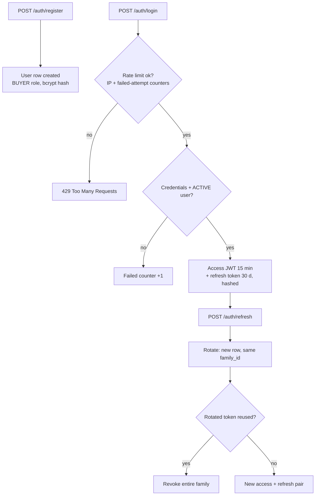
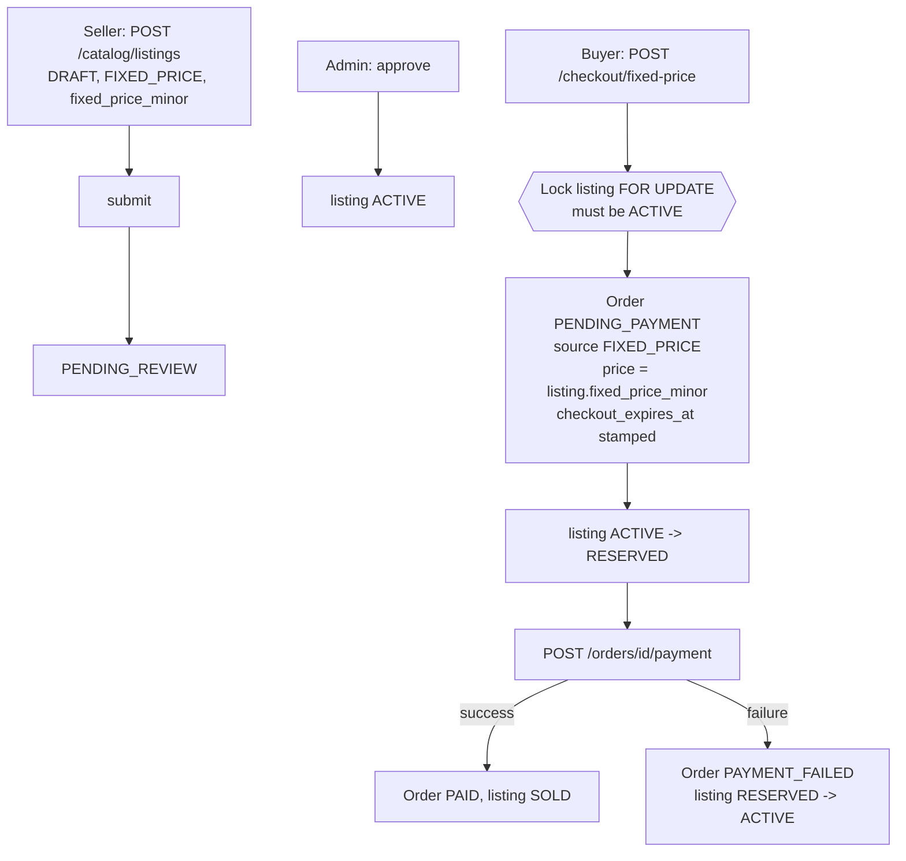
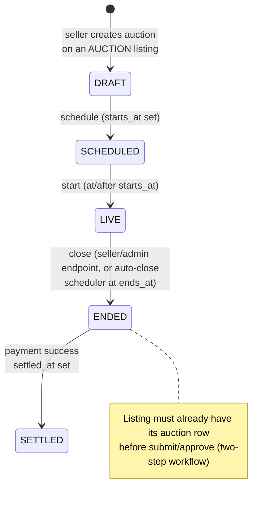
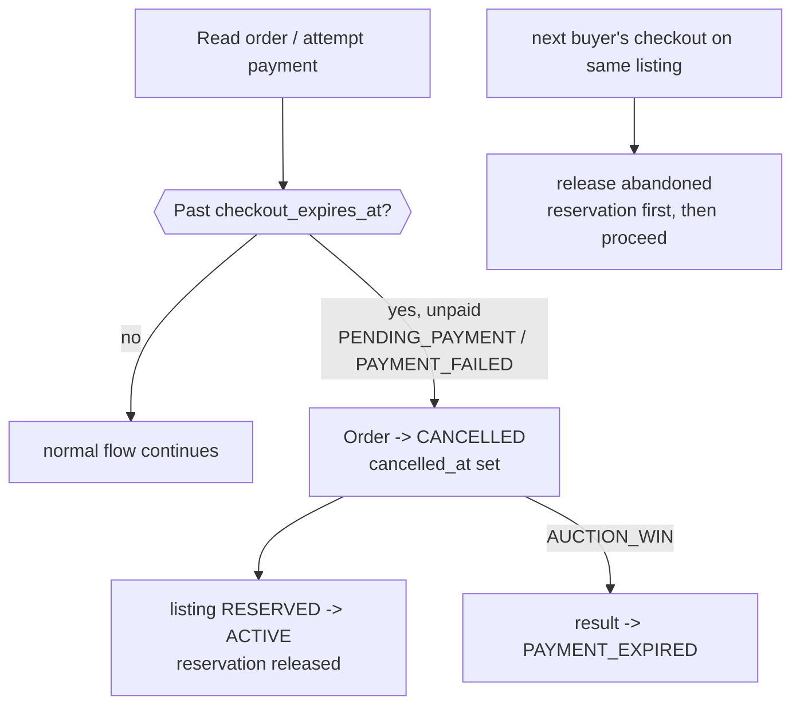
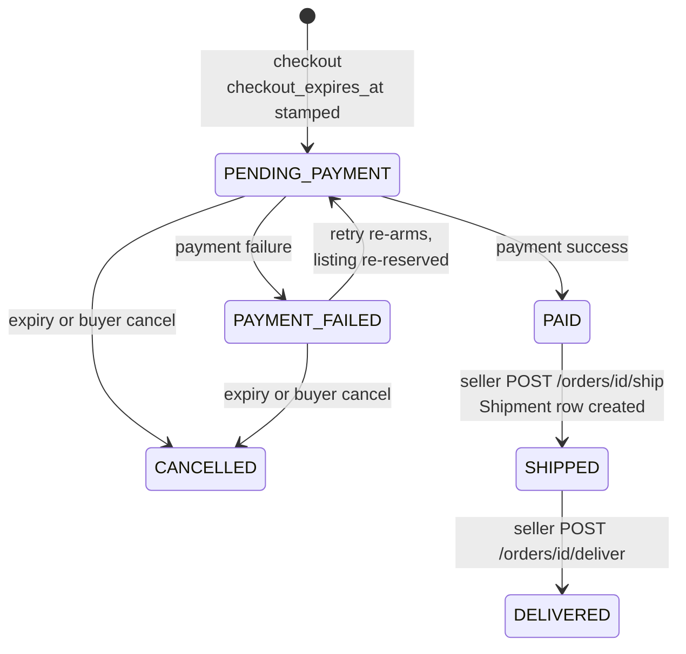
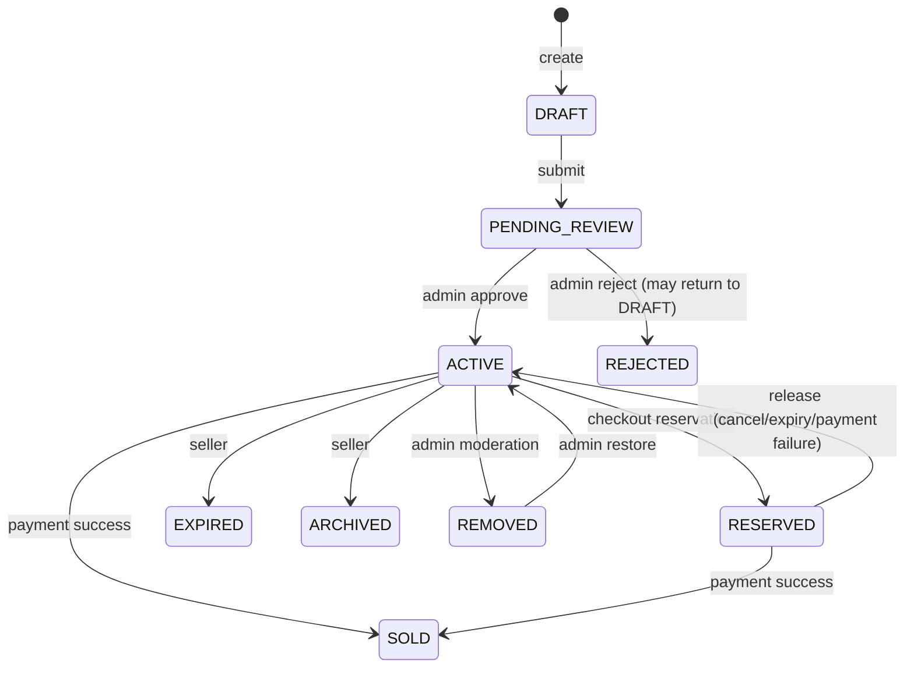
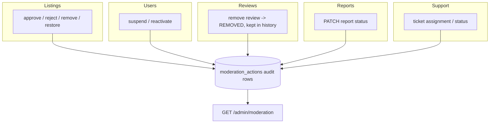
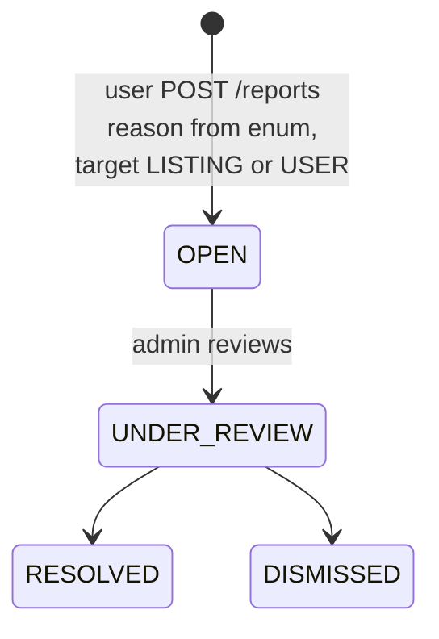
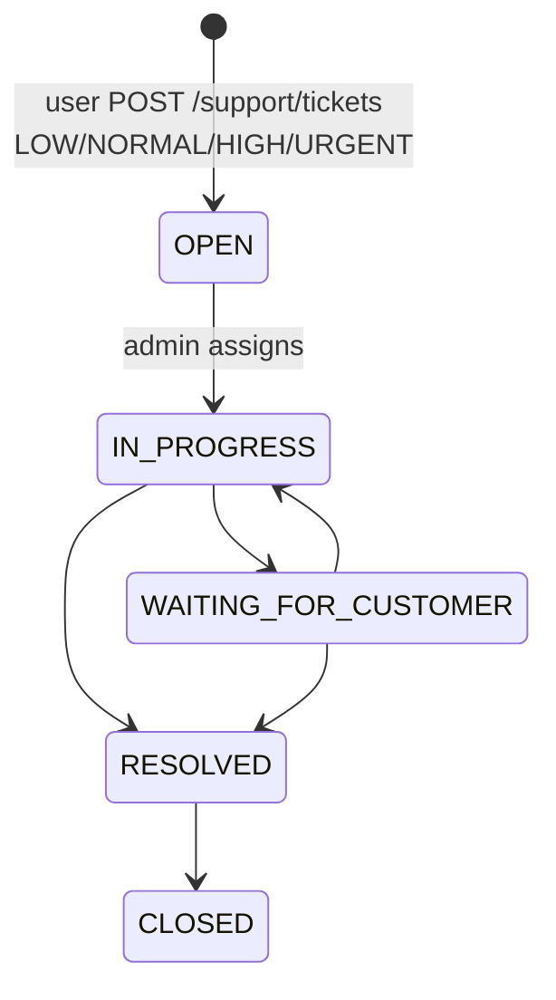

# System & Business Flows

Main flows of the marketplace-platform, described with the actual statuses,
endpoints, and state transitions implemented in the code. All endpoints are
under `/api/v1`.

Legend: `(lazy)` = flipped lazily on the next read/action touching the row;
buyer/seller/admin roles are server-side (`ADMIN` from role rows only).

## High-level system architecture

```mermaid
flowchart LR
    Browser[Browser] --> Web[React / Vite SPA]
    Web -->|REST /api/v1| API[FastAPI modular monolith]
    Web <-.|WebSocket push /api/v1/ws| API
    API -->|SQLAlchemy 2.x + Alembic| DB[(PostgreSQL 17)]
    API --> PAY[DummyPaymentProvider]
    API --> STORE[Local storage abstraction<br/>storage_key references]
```

One API process owns all domain modules (identity, catalog, trading,
orders, admin, notifications, messaging, reports, reviews, support, ws)
and one PostgreSQL database. Redis/queues are intentionally absent (see
[DECISIONS.md](DECISIONS.md) §12).

## Registration / login

```text
POST /auth/register  -> users row (BUYER role, password bcrypt hash)
POST /auth/login     -> access JWT (15 min) + refresh token (hashed row, 30 d)
POST /auth/refresh   -> rotate refresh token (new row, same family_id);
                        reuse of a rotated token revokes the whole family
POST /auth/logout    -> revoke current refresh token
```



Suspended users cannot log in.

## Fixed-price purchase (Buy Now)



## Accepted-offer purchase

```text
buyer:  POST /offers          Offer(PENDING, expires_at optional)
seller: PATCH /offers/{id}    PENDING -> ACCEPTED | REJECTED  (CANCELLED = buyer withdraw)
        (lazy) past expires_at: PENDING -> EXPIRED
buyer:  POST /checkout/offer  (offer must be ACCEPTED; one order per offer)
          Order(PENDING_PAYMENT, source=ACCEPTED_OFFER, price from offer row)
          listing -> RESERVED
then:   payment flow identical to fixed price
```

## Auction lifecycle



## Bidding flow

```text
buyer:  POST /auctions/{id}/bids
          lock auction FOR UPDATE, must be LIVE and inside window
          amount >= floor (current bid + minimum increment, or starting bid)
          idempotent on (auction, bidder, request_id)
          prior WINNING bid -> OUTBID; new bid WINNING
          auction.current_bid/winner pointers updated atomically
GET     /auctions/{id}/bids    public immutable history, newest first
```

The seller cannot bid on their own auction.

## Reserve-price settlement (auction close)

```mermaid
flowchart TD
    C[POST /auctions/id/close, or background<br/>auto-close scheduler (30 s cadence)<br/>only LIVE, ends_at passed] --> L{{Lock auction;<br/>exactly one result row per auction}}
    L --> TOP[Top bid = highest amount, earliest first]
    TOP --> CMP{Compare vs reserve_minor}
    CMP -- "top >= reserve or NULL reserve" --> WON[top bid -> WON<br/>result AWAITING_CHECKOUT<br/>winner, final price, checkout window]
    CMP -- "0 bids, or top < reserve" --> NB[result NO_BIDS<br/>no winner, no WON flips,<br/>no checkout state]
    WON --> ST[auction LIVE -> ENDED]
    NB --> ST2[auction LIVE -> ENDED<br/>listing stays ACTIVE]
```

Below-reserve closes notify the seller "ended below your reserve price"
and emit no `AUCTION_WON` notification.

## Auction winner checkout

```text
winner: POST /checkout/auction   (result must be AWAITING_CHECKOUT,
          caller must be result.winner_id, one order per result)
  past window (lazy): result AWAITING_CHECKOUT -> PAYMENT_EXPIRED, 409
  success: result -> ORDER_CREATED; Order(PENDING_PAYMENT,
            source=AUCTION_WIN, price from result row); listing -> RESERVED
buyer:  POST /orders/{id}/payment
  success: Order -> PAID, listing -> SOLD,
           result -> PAYMENT_COMPLETED, auction -> SETTLED
  failure: Order -> PAYMENT_FAILED, listing -> ACTIVE;
           result stays ORDER_CREATED (retry allowed)
```

## Abandoned checkout expiry (all order sources)



## Buyer cancellation

```text
buyer: POST /orders/{id}/cancel   (must own the order)
  allowed only while PENDING_PAYMENT or PAYMENT_FAILED
  Order -> CANCELLED, listing RESERVED -> ACTIVE
  AUCTION_WIN: result -> PAYMENT_EXPIRED
```

## Order / payment lifecycle



- Payments: DUMMY provider, `idempotency_key` unique, one SUCCEEDED
  payment per order (partial unique index); every transition appends an
  immutable `order_status_history` row.
- Reads: `GET /orders/me` (buyer), `GET /seller/orders` (seller),
  `GET /orders/{id}` (buyer/seller/admin).

## Seller listing lifecycle



## Moderation flow (admin)



Every admin mutation writes an audit row into `moderation_actions`, kept
separate from the domain tables.

## Reviews

```text
buyer: POST /reviews  (only after DELIVERED order, one per order,
          rating 1-5 + optional text, reviews the seller)
statuses: ACTIVE -> REMOVED (admin soft removal)
reads:   public on seller profile, GET /reviews/me (author),
         GET /reviews/user/{id} (hidden REMOVED)
```

## Notifications

In-app bell fed by domain events, pushed live over WebSocket
(`/api/v1/ws`, auth via token query param). Types (enum): OFFER_RECEIVED,
OFFER_ACCEPTED, ORDER_PLACED, PAYMENT_SUCCEEDED, ORDER_SHIPPED,
ORDER_DELIVERED, AUCTION_WON, AUCTION_ENDED, OUTBID, REVIEW_RECEIVED,
LISTING_APPROVED, LISTING_REJECTED, LISTING_REMOVED, LISTING_RESTORED.

```text
GET    /notifications, /notifications/unread-count
PATCH  /notifications/{id}/read
POST   /notifications/mark-read
```

Notifications are never deleted; read state is a flag.

## Messaging

```mermaid
flowchart LR
    B[Buyer] -->|"POST /conversations<br/>start from a listing"| C[(one conversation<br/>per buyer-listing pair)]
    S[Seller] --> C
    B & S -->|GET /conversations, /conversations/{id}| C
    B & S -->|"POST /conversations/{id}/messages"| C
    P{{Participant check}} --> C
```

Messages are append-only; only participants may view or append.

## Reports



Admin lists via `GET /admin/reports`, updates via
`PATCH /admin/reports/{id}/status`; each status change is audited.

## Support tickets



Ticket replies are thread rows in `support_ticket_messages`, visible to
the owner and admins only.
